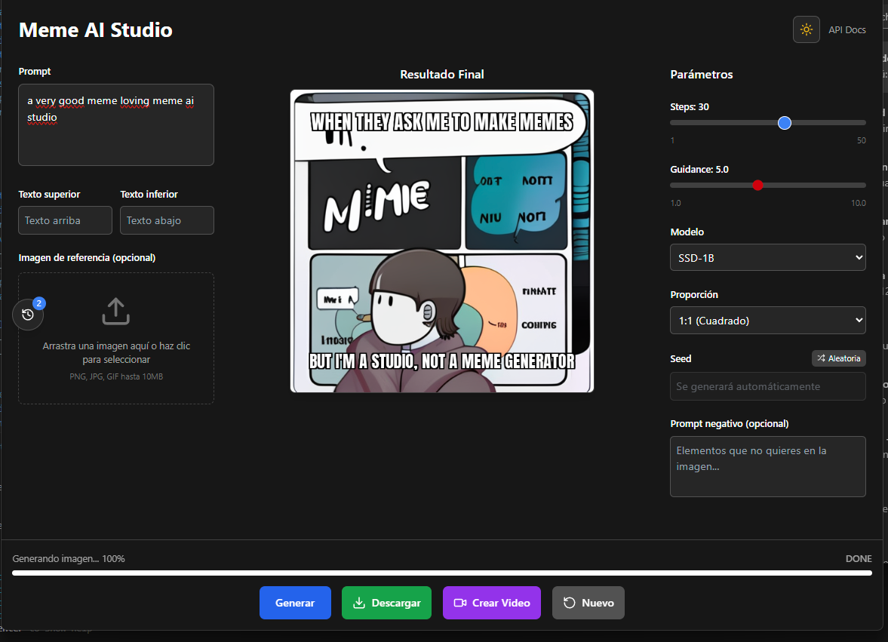

# 🎭 Meme AI Generator

[](https://www.python.org/downloads/)
[](https://fastapi.tiangolo.com/)
[](https://reactjs.org/)
[](https://www.typescriptlang.org/)
[](https://www.docker.com/)
[](https://developer.nvidia.com/cuda-downloads)
[](LICENSE)

**AI-powered meme and video generator combining the best of modern AI**: Ollama LLM for creative text generation, SSD-1B for ultra-fast image synthesis, and Stable Video Diffusion for animated content. Create hilarious memes and engaging videos with professional typography in seconds!

## 🖼️ Web Interface



*The modern, responsive web interface featuring real-time generation progress, parameter controls, and instant meme creation with Spanish localization.*

## ⚡ Key Features

- **🎯 AI-Powered Text Generation** - Ollama LLM creates witty, contextual meme text
- **🖼️ High-Quality Image Generation** - SSD-1B model for crisp, detailed visuals
- **🎬 Video Meme Creation** - Stable Video Diffusion for animated content
- **🎨 Custom Typography** - Multiple font options with dynamic text positioning
- **⚡ Real-Time WebSocket Updates** - Live progress tracking with automatic reconnection
- **🐳 Containerized Deployment** - Docker Compose with health checks and service dependencies
- **🔄 Background Processing** - Redis queue system with pub/sub for real-time notifications
- **📱 Responsive Design** - Modern React TypeScript frontend with custom hooks

## 🏗️ Architecture Overview

```
┌─────────────────┐    ┌─────────────────┐    ┌─────────────────┐
│   React + TS    │    │   FastAPI       │    │   Redis Queue   │
│   Frontend      │◄──►│   Backend       │◄──►│  Image Worker   │
│   (Port 5173)   │    │   (Port 8000)   │    │   Processing    │
└─────────────────┘    └─────────────────┘    └─────────────────┘
         │                       │                       │
    WebSocket                    │              ┌─────────────────┐
    Real-time                    │              │   Ollama LLM    │
    Updates                      │              │   (Port 11434)  │◄─────────────┘
         │              ┌─────────────────┐     └─────────────────┘              
         │              │  Redis Pub/Sub  │              │                       
         │◄─────────────│   Real-time     │              │              
         │              │  Notifications  │              │
         │              └─────────────────┘    ┌─────────────────┐              
         │                       │            │     SSD-1B      │              
         │                       │            │  Image Model    │◄─────────────┘
         │                       │            └─────────────────┘              
         │                       │                       │                       
         │              ┌─────────────────┐    ┌─────────────────┐
         │              │ Stable Video    │    │  Video Worker   │
         │              │   Diffusion     │◄──►│   Processing    │
         │              └─────────────────┘    └─────────────────┘
         │                                               │
    ┌─────────────────┐                                  │
    │  Static Files   │                                  │
    │ /outputs (PNG)  │◄─────────────────────────────────┘
    │ /outputs (MP4)  │                                  
    └─────────────────┘                                  
```

### 🔄 Content Generation Pipeline

#### 🖼️ Meme Generation
1. **User Input** → Prompt submission via React frontend
2. **LLM Processing** → Ollama generates image description + meme text (top/bottom)
3. **Image Generation** → SSD-1B creates base image from description
4. **Text Overlay** → Professional meme text rendering with custom font
5. **Delivery** → Real-time progress updates and final meme download

#### 🎬 Video Generation
1. **Image Input** → Use existing generated meme or upload custom image
2. **Video Processing** → Stable Video Diffusion animates the image
3. **Frame Generation** → Creates 25 frames at 7 FPS with motion effects
4. **Video Export** → Exports to MP4 format with optimized settings
5. **Delivery** → Real-time progress updates and final video download

## 🚀 Quick Start

### Prerequisites

- **Docker & Docker Compose** - Container orchestration
- **NVIDIA GPU** (recommended) - CUDA 12.x for optimal performance
- **8GB+ RAM** - For model loading and inference
- **Internet Connection** - Auto-downloads AI models on first run

### 🐳 Docker Deployment (Recommended)

1. **Start All Services**
```bash
# Launch all services with real-time WebSocket updates
docker compose up --build

# Download the LLM model (one-time setup)
docker exec -it $(docker ps -qf name=ollama) ollama pull llama3.1:8b
```
> 📝 **Note**: SSD-1B model (~2GB) downloads automatically from HuggingFace on first use

2. **Access the Application**
   - **Frontend**: http://localhost:5173 (with live WebSocket updates)
   - **API Documentation**: http://localhost:8000/docs
   - **Generated Memes**: http://localhost:8000/outputs/
   - **Health Check**: http://localhost:8000/api/health

### 💻 Local Development Setup

<details>
<summary>Click to expand local development instructions</summary>

**Backend Setup**
```bash
cd backend
python -m venv .venv
source .venv/bin/activate  # Windows: .venv\Scripts\activate
pip install -r requirements.txt

# Set environment variables
export OLLAMA_HOST=http://localhost:11434
export PYTHONPATH=/path/to/backend

# Start services
uvicorn app.main:app --reload --host 0.0.0.0 --port 8000
rq worker meme  # In separate terminal
```

**Frontend Setup**
```bash
cd frontend
pnpm install
pnpm dev  # Proxies API requests to localhost:8000
```

</details>

## 🎨 Usage Examples

### Basic Meme Generation

```bash
curl -X POST "http://localhost:8000/api/jobs" \
  -H "Content-Type: application/json" \
  -d '{
    "prompt": "Programmer debugging code at 3 AM",
    "steps": 30,
    "guidance": 7.5
  }'
```

### Advanced Configuration

```bash
curl -X POST "http://localhost:8000/api/jobs" \
  -H "Content-Type: application/json" \
  -d '{
    "prompt": "Cat sitting on laptop keyboard",
    "seed": 12345,
    "steps": 40,
    "guidance": 5.0,
    "negative": "blurry, low quality, distorted"
  }'
```

### Check Job Status

```bash
curl "http://localhost:8000/api/jobs/{job_id}"
```

## 📚 API Reference

### Endpoints

| Method | Endpoint | Description |
|--------|----------|-------------|
| `POST` | `/api/jobs` | Create new meme generation job |
| `POST` | `/api/video-jobs` | Create new video generation job |
| `GET` | `/api/jobs/{job_id}` | Get job status and result |
| `GET` | `/api/video-jobs/{job_id}` | Get video job status and result |
| `GET` | `/outputs/{filename}` | Download generated meme or video |
| `GET` | `/docs` | Interactive API documentation |
| `GET` | `/health` | Health check endpoint |

### Request Schema

```typescript
interface CreateJob {
  prompt: string;           // Meme theme or description
  seed?: number;           // Reproducible generation (optional)
  negative?: string;       // Negative prompts to avoid (optional)
  steps?: number;          // Inference steps (default: 30)
  guidance?: number;       // Guidance scale (default: 5.0)
}
```

### Response Schema

```typescript
interface JobStatus {
  status: 'queued' | 'running' | 'done' | 'error';
  progress?: number;       // 0-100 for queued/running
  imageUrl?: string;       // Available when status === 'done'
  meta?: {
    seed: number;
    steps: number;
    model: string;
    prompt: string;
    top?: string;          // Top meme text
    bottom?: string;       // Bottom meme text
  };
  message?: string;        // Error message if status === 'error'
}
```

## ⚙️ Configuration

### Environment Variables

| Variable | Default | Description |
|----------|---------|-------------|
| `OLLAMA_HOST` | `http://localhost:11434` | Ollama service URL |
| `REDIS_URL` | `redis://redis:6379` | Redis connection string |
| `PYTHONPATH` | `/app` | Python module path |

### Model Configuration

- **LLM Model**: `llama3.1:8b` (Ollama)
- **Image Model**: `segmind/SSD-1B` (HuggingFace)
- **Font**: Anton-Regular.ttf (included)
- **Output Format**: PNG with transparency support

## 🔧 Troubleshooting

<details>
<summary><strong>GPU/CUDA Issues</strong></summary>

- Ensure NVIDIA drivers and CUDA 12.x are installed
- Verify GPU access: `docker run --gpus all nvidia/cuda:12.1-base-ubuntu20.04 nvidia-smi`
- For CPU-only mode, models will automatically fallback but expect slower performance

</details>

<details>
<summary><strong>Model Download Issues</strong></summary>

- **Ollama Model**: `docker exec -it ollama-container ollama pull llama3.1:8b`
- **SSD-1B**: Automatically downloads from HuggingFace (~2GB), ensure stable internet
- Check disk space: Models require ~10GB total storage

</details>

<details>
<summary><strong>Memory Issues</strong></summary>

- **RAM**: Ensure 8GB+ available for model loading
- **VRAM**: 6GB+ recommended for optimal performance
- Reduce `steps` parameter if running out of memory

</details>

<details>
<summary><strong>Port Conflicts</strong></summary>

```bash
# Check port usage
sudo lsof -i :8000  # FastAPI
sudo lsof -i :11434 # Ollama
sudo lsof -i :6379  # Redis
sudo lsof -i :5173  # Frontend
```

</details>

## 🚀 Performance & Benchmarks

### SSD-1B vs Stable Diffusion XL

| Metric | SSD-1B | SDXL | Improvement |
|--------|--------|------|-------------|
| Parameters | ~1B | ~3.5B | 71% smaller |
| Generation Speed | ~2-3s | ~5-8s | 60% faster |
| VRAM Usage | ~4GB | ~8GB | 50% less |
| Model Size | ~2GB | ~7GB | 71% smaller |
| Quality | High | High | Comparable |

### Typical Generation Times (RTX 3080)

- **30 steps**: ~3-4 seconds
- **50 steps**: ~5-6 seconds
- **Queue processing**: <1 second overhead

## 📁 Project Structure

```
meme-ai/
├── backend/                 # FastAPI backend with modular architecture
│   ├── app/
│   │   └── main.py         # API routes and CORS setup
│   ├── config/             # Configuration management
│   │   ├── __init__.py
│   │   └── settings.py     # Model configs, environment variables
│   ├── models/             # AI model loading and management
│   │   ├── __init__.py
│   │   └── image_models.py # SSD-1B and SDXL model loaders
│   ├── services/           # Business logic services
│   │   ├── __init__.py
│   │   ├── image_service.py    # Image generation logic
│   │   ├── ollama_service.py   # LLM API integration
│   │   └── video_service.py    # Video generation with SVD
│   ├── utils/              # Utility functions
│   │   ├── __init__.py
│   │   └── text_overlay.py # Meme text rendering
│   ├── worker.py           # Image generation job processor
│   ├── video_worker.py     # Video generation job processor
│   ├── Dockerfile          # Backend container config
│   └── requirements.txt    # Python dependencies (updated with video libs)
├── frontend/               # React + TypeScript frontend
│   ├── src/
│   │   ├── components/     # UI components
│   │   ├── hooks/         # Custom React hooks
│   │   ├── App.tsx        # Main application
│   │   └── api.ts         # Backend API client
│   ├── package.json       # Node.js dependencies
│   └── vite.config.ts     # Vite configuration
├── fonts/                 # Typography assets
│   └── Anton-Regular.ttf  # Meme font (OFL licensed)
├── outputs/               # Generated content storage (PNG + MP4)
├── docker-compose.yml     # Multi-service orchestration
└── README.md             # This file
```

## 🏗️ Modular Architecture

The backend has been **completely refactored** into a clean, modular architecture for better maintainability and testing:

### **📦 Core Modules**

- **`config/settings.py`** - Centralized configuration management
  - Model configurations (SSD-1B, SDXL, SVD)
  - Environment variables and device settings
  - Path and font configurations

- **`models/image_models.py`** - AI model loading and caching
  - SSD-1B pipeline management (`get_pipe()`)
  - SDXL base and refiner models (`load_sdxl_models()`)
  - Memory-efficient model loading with global instances

- **`services/`** - Business logic separation
  - **`ollama_service.py`** - LLM API integration and prompt processing
  - **`image_service.py`** - Image generation orchestration
  - **`video_service.py`** - Video generation with Stable Video Diffusion

- **`utils/text_overlay.py`** - Typography and text rendering utilities

### **🎬 Video Generation System**

**New Components:**
- **`video_worker.py`** - Dedicated video job processor
- **`services/video_service.py`** - SVD integration with optimizations
- **Updated `requirements.txt`** - Added OpenCV, ImageIO, FFmpeg support

**Video Features:**
- **Model**: Stable Video Diffusion (`stabilityai/stable-video-diffusion-img2vid-xt`)
- **Output**: MP4 videos with 25 frames at 7 FPS
- **Input**: Any generated meme or uploaded image (320x576 resolution)
- **Memory Optimization**: CPU offload, XFormers support, chunk decoding

### **⚡ Video Performance Optimization**

**Current Performance Issues:**
- Video generation takes significantly longer than image generation (~30-60 seconds)
- SVD model is computationally intensive (~3.5GB model size)
- Memory usage can be high during video processing

**Optimization Strategies:**
1. **Reduce Frame Count**: Default 25 frames → 16 frames for faster generation
2. **Lower Resolution**: 320x576 → 256x448 for quicker processing
3. **Model Quantization**: Use FP16 precision and enable memory-efficient attention
4. **Batch Processing**: Process multiple video requests in sequence
5. **Caching**: Cache frequently used base images for video generation

**Performance Benchmarks (RTX 3080):**
- **16 frames**: ~20-30 seconds
- **25 frames**: ~35-50 seconds  
- **Memory usage**: ~6-8GB VRAM during generation

## 🤝 Contributing

We welcome contributions! Here's how to get started:

1. **Fork** the repository
2. **Create** a feature branch: `git checkout -b feature/amazing-feature`
3. **Commit** your changes: `git commit -m 'Add amazing feature'`
4. **Push** to the branch: `git push origin feature/amazing-feature`
5. **Open** a Pull Request

### Development Guidelines

- Follow existing code style and conventions
- Add tests for new features
- Update documentation as needed
- Ensure all containers build successfully
- Test across different GPU configurations

## 🛣️ Roadmap & Future Improvements

### 🎯 Short-term Goals
- [ ] **Multiple Font Support** - Add variety to meme typography
- [ ] **Custom Templates** - Pre-built meme layouts and styles
- [ ] **Batch Processing** - Generate multiple memes simultaneously
- [ ] **Enhanced UI** - Advanced parameter controls and preview modes
- [ ] **Performance Optimization** - Model quantization and caching

### 🚀 Long-term Vision
- [ ] **Multi-language Support** - LLM prompts in various languages
- [x] **Video Memes** - ✅ Animated MP4 generation with Stable Video Diffusion
- [ ] **Social Integration** - Direct sharing to platforms
- [ ] **Custom Model Training** - Fine-tune on specific meme styles
- [ ] **Mobile App** - Native iOS and Android applications
- [ ] **Community Features** - Meme gallery and voting system

### 💡 Suggested Improvements

**Technical Enhancements:**
- ✅ **WebSocket Real-Time Updates** - Implemented with automatic reconnection and pub/sub
- Add Redis caching for frequently generated memes  
- Support for additional image models (DALL-E, Midjourney API)
- Implement proper logging and monitoring (Prometheus/Grafana)
- Add comprehensive test suite (unit, integration, E2E)
- Kubernetes deployment manifests for production scaling

**User Experience:**
- Drag-and-drop image uploads for custom backgrounds
- Advanced text positioning and styling controls
- Meme history and favorites system
- Social sharing with metadata preservation
- Mobile-responsive design improvements

**AI & ML Improvements:**
- Fine-tune LLM for better meme context understanding
- Implement style transfer for consistent visual themes
- Add NSFW content detection and filtering
- Support for trending meme formats detection

## 📄 License

This project is licensed under the MIT License - see the [LICENSE](LICENSE) file for details.

## 🙏 Acknowledgments

- **[Segmind](https://huggingface.co/segmind)** - For the incredible SSD-1B model
- **[Ollama](https://ollama.ai/)** - For making LLM deployment accessible  
- **[HuggingFace](https://huggingface.co/)** - For the model distribution platform
- **[FastAPI](https://fastapi.tiangolo.com/)** - For the excellent Python API framework
- **[React](https://reactjs.org/)** & **[Vite](https://vitejs.dev/)** - For the modern frontend tooling

---

<div align="center">

**Made with ❤️ by the community**

[Report Bug](https://github.com/Sefito/meme-ai/issues) • [Request Feature](https://github.com/Sefito/meme-ai/issues) • [Contribute](https://github.com/Sefito/meme-ai/pulls)

</div>
